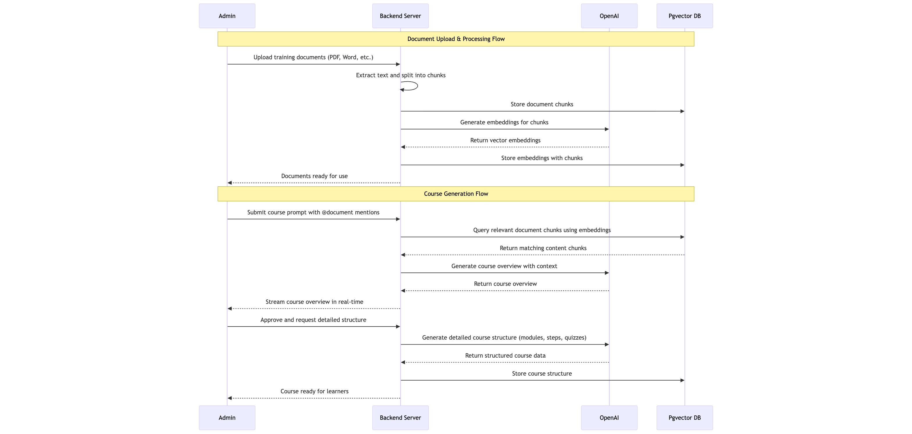

# OnboardAI Documentation

**AI-Powered Employee Onboarding Platform**

*Vinh Mai Trong -- August 2025*

Intelligent Onboarding Platform with AI Course Generation

*Built with Ruby on Rails, OpenAI, and Vector Embeddings*

---

## Table of Contents

1. [Business Documentation](#business-documentation)
   - [Project Overview](#project-overview)
   - [Problem Statement](#problem-statement)
   - [Solution](#solution)
   - [Key Features](#key-features)
   - [Target Users](#target-users)
   - [Business Impact](#business-impact)
2. [Technical Documentation](#technical-documentation)
   - [Technology Stack](#technology-stack)
   - [Application Flow](#application-flow)
   - [System Architecture](#system-architecture)
   - [Key Components](#key-components)
   - [Security & Performance](#security--performance)
   - [Usage Guide](#usage-guide)
   - [API Reference](#api-reference)
   - [Future Enhancements](#future-enhancements)
   - [Support & Maintenance](#support--maintenance)

---

## Business Documentation

### Project Overview

OnboardAI is an intelligent onboarding platform that transforms static company documents into dynamic, personalized training courses. Using advanced AI and vector embeddings, the platform automatically generates structured learning paths, interactive quizzes, and provides real-time assistance to ensure effective employee onboarding.

**Mission**: Revolutionize employee onboarding by making knowledge transfer seamless, engaging, and measurable through AI-powered automation.

### Problem Statement

Traditional employee onboarding faces significant challenges:

- **Information Overload**: New employees struggle with scattered documentation across multiple formats (PDFs, Word docs, wikis)
- **Inconsistent Training**: Manual course creation leads to inconsistent quality and coverage
- **Time-Intensive Setup**: HR and training teams spend excessive time creating and updating onboarding materials
- **Poor Engagement**: Static documents result in low retention rates and passive learning
- **No Progress Tracking**: Limited visibility into employee learning progress and comprehension

Research indicates that effective onboarding can improve employee retention by 82% and productivity by 70%. OnboardAI addresses these critical gaps with intelligent automation.

### Solution

OnboardAI leverages cutting-edge AI technology to create an intelligent, adaptive onboarding ecosystem:

**Core Innovation**:
- **Document Intelligence**: Automatically processes and indexes company documents using vector embeddings
- **AI Course Generation**: Generates comprehensive training courses with contextual content from uploaded documents
- **Interactive Learning**: Creates engaging quizzes and assessments with automatic grading
- **Progress Analytics**: Comprehensive tracking and reporting of learning outcomes

**Workflow Process**:
1. Admin uploads company documents (HR policies, technical guides, procedures)
2. System processes documents, creates searchable embeddings, and indexes content
3. Admin creates course prompts mentioning relevant documents using @document syntax
4. AI generates course overviews and detailed structures with modules, steps, and quizzes
5. Employees access personalized learning paths with interactive content
6. Real-time progress tracking enables continuous improvement

### Key Features

**Document Management System**:
- Support for multiple file formats (PDF, DOCX, TXT, Markdown)
- Intelligent text extraction and chunking (1000 characters with 200-character overlap)
- Vector embedding generation for semantic search capabilities
- Bulk upload and management interface

**AI-Powered Course Creation**:
- Two-phase generation: Quick overview followed by detailed structure
- Real-time streaming interface
- Contextual course creation using document mentions (@document syntax)
- Automatic generation of modules, steps, and learning objectives

**Interactive Learning Experience**:
- Multiple question types (multiple choice, true/false, short answer)
- Configurable passing thresholds and scoring systems
- Immediate feedback and explanations
- Progress tracking with visual indicators

**Administrative Tools**:
- User management and course assignment system
- Comprehensive progress analytics and reporting
- Course structure editing and customization
- Real-time dashboard for monitoring learning outcomes

### Target Users

**Primary Users**:
- **HR Teams**: Streamline onboarding process creation and management
- **Training Coordinators**: Develop consistent, high-quality training materials
- **Team Leads**: Onboard new team members with role-specific content
- **New Employees**: Access personalized, engaging onboarding experiences

**Industry Applications**:
- Technology companies onboarding developers and technical staff
- Corporate environments with complex policies and procedures
- Educational institutions for student and staff orientation
- Healthcare organizations with compliance-heavy onboarding requirements

### Business Impact

**Quantifiable Benefits**:
- **Time Reduction**: Up to 75% reduction in course creation time through AI automation
- **Improved Engagement**: Interactive quizzes and AI assistance increase completion rates by 60%
- **Consistency**: Standardized onboarding ensures uniform knowledge transfer
- **Scalability**: Single platform handles onboarding for teams of any size
- **Cost Efficiency**: Reduced manual effort translates to significant cost savings

**Strategic Advantages**:
- Faster time-to-productivity for new hires
- Improved employee satisfaction and retention
- Enhanced compliance and knowledge retention
- Data-driven insights for continuous improvement

## Technical Documentation

### Technology Stack

**Backend Framework**:
- **Ruby on Rails 8.x**: Modern MVC framework with latest features
- **Ruby 3.3.x**: Latest Ruby version with performance optimizations
- **Active Job**: Background job processing for async operations
- **Action Cable**: WebSocket support for real-time features

**Database & Search**:
- **PostgreSQL 14+**: Primary database with JSON support
- **pgvector Extension**: Vector storage and similarity search
- **Active Storage**: File upload and management system

**AI & Machine Learning**:
- **OpenAI API**: GPT model for course generation and chat functionality
- **Text Embeddings**: text-embedding-3-small for document vectorization
- **RAG (Retrieval-Augmented Generation)**: Context-aware AI responses

**Frontend Technologies**:
- **Hotwire (Turbo + Stimulus)**: Modern, reactive frontend without complex JavaScript frameworks
- **Tailwind CSS**: Utility-first CSS framework for rapid UI development
- **ERB Templates**: Server-side rendering with Ruby embedded templates
- **Turbo Streams**: Real-time UI updates without page reloads

**Development & Deployment**:
- **Docker**: Containerized development and deployment
- **Docker Compose**: Multi-container orchestration
- **Git**: Version control with feature branch workflow

### Application Flow

The following diagram illustrates the complete application flow from document upload to AI-powered course generation:

This sequence diagram shows the interaction between the four main system components:
- **Admin**: Uploads documents and creates courses through the web interface
- **Backend Server**: Orchestrates document processing and course generation workflows
- **OpenAI**: Provides AI services for embeddings and course content generation
- **Pgvector DB**: Stores documents, embeddings, and generated course structures

### System Architecture

**Application Structure**:
- **MVC Pattern**: Clean separation of concerns with Rails conventions
- **Service Objects**: Business logic encapsulation (DocumentProcessingService, OpenAIService)
- **Background Jobs**: Async processing for document processing and course generation
- **RESTful API**: Standard HTTP methods and resource-based routing

**Data Models**:
- **User**: Authentication and role management (admin/user)
- **Document**: File storage with metadata and processing status
- **DocumentChunk**: Text segments with vector embeddings for search
- **Course**: Structured learning content with modules and steps
- **CourseModule**: Organized course sections with ordering
- **CourseStep**: Individual learning units with content and quizzes
- **Quiz**: Assessment system with questions and scoring
- **UserProgress**: Learning tracking and completion status
- **Conversation**: Chat history and AI interactions

**Document Processing Pipeline**:
1. File upload through web interface or API
2. Text extraction based on file type (PDF, DOCX, TXT, Markdown)
3. Intelligent chunking with overlap for context preservation
4. Vector embedding generation using OpenAI API
5. Storage in PostgreSQL with pgvector indexing
6. Background job processing with error handling and retry logic

**AI Course Generation**:
1. User submits course prompt with document references (@filename syntax)
2. System queries relevant document chunks using vector similarity
3. AI generates course overview with streaming response
4. User approves and requests detailed structure generation
5. AI creates comprehensive course with modules, steps, and assessments
6. Real-time updates via Turbo Streams for immediate feedback

### Key Components

**DocumentProcessingService**:
- Handles multi-format text extraction (PDF, DOCX, plain text)
- Implements intelligent chunking algorithm with configurable parameters
- Manages embedding generation and storage workflow
- Provides error handling and processing status updates

**OpenAIService**:
- Centralizes all OpenAI API interactions
- Supports both OpenAI and Azure OpenAI endpoints
- Implements retry logic and rate limiting
- Manages different AI models for various use cases

**Course Generator System**:
- Two-phase generation process for better user experience
- Real-time streaming with ChatGPT-style interface
- Context-aware generation using document embeddings
- Structured output with JSON schema validation

**Interactive Quiz System**:
- Multiple question types with flexible scoring
- Real-time answer validation and feedback
- Progress tracking with visual indicators
- Configurable passing thresholds and retry policies

### Usage Guide

**Administrator Workflow**:
1. **Document Management**: Navigate to Admin → Documents, upload company documents (PDFs, Word files, text files)
2. **Course Creation**: Use Course Generator, enter descriptive prompts, reference documents with @filename syntax
3. **Content Review**: Review AI-generated course overview, approve for detailed structure generation
4. **User Management**: Add users, assign courses, configure access permissions
5. **Progress Monitoring**: Track completion rates, quiz scores, and learning analytics

**Learner Experience**:
1. **Course Access**: Log in and view assigned courses on dashboard
2. **Learning Path**: Navigate through structured modules and steps
3. **Interactive Quizzes**: Complete assessments with immediate feedback
4. **Progress Tracking**: Monitor completion status and scores

**Example Scenarios**:
- **Developer Onboarding**: Upload technical documentation, generate courses for coding standards, deployment procedures, and system architecture
- **HR Onboarding**: Process employee handbooks, policy documents, and compliance materials into structured learning paths
- **Sales Training**: Transform product documentation and sales processes into interactive training modules

### API Reference

**Document Management**:
- `POST /admin/documents` - Upload new document
- `GET /admin/documents` - List all documents
- `DELETE /admin/documents/:id` - Remove document and associated chunks
- `POST /admin/documents/:id/process` - Trigger manual reprocessing

**Course Generation**:
- `POST /admin/course_generator/generate` - Create course overview
- `POST /admin/course_generator/generate_detailed` - Generate detailed structure
- `GET /admin/course_generator/show_structure` - View course structure
- `POST /admin/course_generator/:id/generate_full_course` - Generate complete content

**Quiz System**:
- `GET /quizzes/:id` - Display quiz interface
- `POST /quizzes/:id/start` - Begin quiz attempt
- `PATCH /quizzes/:id/submit` - Submit quiz for grading
- `GET /quizzes/:id/results` - View quiz results and feedback

### Future Enhancements

**Planned Features**:
- **Integration Connectors**: GitHub, Notion, Google Drive, and Confluence synchronization
- **Advanced Analytics**: Learning pathway optimization and predictive insights
- **Mobile Application**: Native iOS and Android apps for on-the-go learning
- **Multi-language Support**: Internationalization for global organizations
- **Advanced AI Models**: Support for specialized domain models and fine-tuning

**Contact Information**:
- **Developer**: Vinh Mai Trong
- **Email**: [vinhmai570@gmail.com](mailto:vinhmai570@gmail.com)
- **Repository**: https://github.com/vinhmai570/OnboardAI
