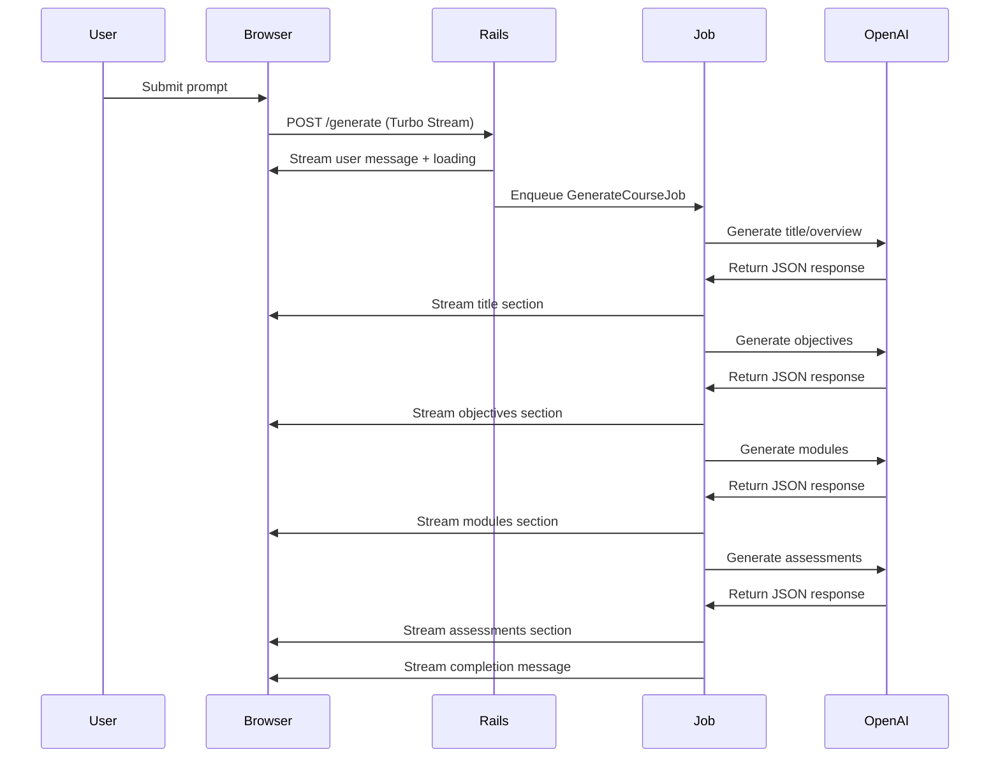

# Turbo Stream Chat Implementation

## Overview

The "Generate Course with AI" feature has been updated to use **Turbo Streams** instead of AJAX for real-time chat functionality. This provides a more Rails-native approach with streaming responses that appear piece by piece as they're generated.

## Key Changes Made

### 🚀 **Background Job Architecture**
- **`GenerateCourseJob`** - Background job that handles AI course generation
- **Streaming Response** - Breaks course generation into parts (title, objectives, modules, assessments)
- **Real-time Updates** - Uses Turbo Streams to push updates to the browser
- **Progressive Loading** - Content appears incrementally instead of all at once

### 📡 **Turbo Stream Integration**
- **Channel Subscription** - `<%= turbo_stream_from "course_generator" %>`
- **Broadcast Updates** - `Turbo::StreamsChannel.broadcast_*` methods
- **Form Integration** - `data: { turbo_stream: true }` on forms
- **Auto-scroll** - JavaScript observer for smooth chat experience

### 🎯 **Streaming Flow**
1. User submits prompt → Immediate response with user message + loading
2. Background job starts → Removes loading, shows streaming container
3. AI generates title/overview → Streams to browser
4. AI generates objectives → Streams to browser
5. AI generates modules → Streams to browser
6. AI generates assessments → Streams to browser
7. Shows referenced documents → Final streaming complete message

## Technical Implementation

### **Files Created/Modified**

#### **Background Job**: `app/jobs/generate_course_job.rb`
```ruby
class GenerateCourseJob < ApplicationJob
  def perform(prompt, mentioned_document_ids, session_id)
    # Streaming implementation with multiple AI calls
    stream_course_title_and_overview(prompt, context_chunks)
    stream_course_objectives(prompt, context_chunks)
    stream_course_modules(prompt, context_chunks)
    stream_course_assessments(prompt, context_chunks)
    # ... etc
  end

  def broadcast_course_section(section_type, content)
    Turbo::StreamsChannel.broadcast_append_to(
      "course_generator",
      target: "streaming-content",
      partial: "admin/course_generator/course_section",
      locals: { section_type: section_type, content: content }
    )
  end
end
```

#### **Turbo Stream Partials**:
- **`_user_message.html.erb`** - User chat message styling
- **`_loading_message.html.erb`** - Loading indicator with spinner
- **`_error_message.html.erb`** - Error message display
- **`_streaming_start.html.erb`** - Container for streaming content
- **`_course_section.html.erb`** - Individual course sections (title, objectives, modules, etc.)
- **`_streaming_complete.html.erb`** - Success completion message

#### **Controller Updates**: `app/controllers/admin/course_generator_controller.rb`
```ruby
def generate
  respond_to do |format|
    format.turbo_stream do
      render turbo_stream: [
        turbo_stream.append("chat-messages", partial: "user_message", locals: { prompt: @prompt }),
        turbo_stream.append("chat-messages", partial: "loading_message"),
        turbo_stream.update("course-prompt", ""),
        turbo_stream.update("referenced-docs", "")
      ]

      GenerateCourseJob.perform_later(@prompt, mentioned_document_ids, session.id.to_s)
    end
  end
end
```

#### **JavaScript Updates**: `_course_generator_turbo_script.html.erb`
- **Removed AJAX code** - No more fetch() calls or manual DOM manipulation
- **Simplified to document mentions only** - @ mention functionality preserved
- **Auto-scroll observer** - Automatically scrolls to new messages
- **Form integration** - `turbo:submit-end` event handling

## Streaming Sections

### **1. Title & Overview**
```json
{
  "title": "Course Title",
  "description": "Course description",
  "duration_estimate": "X hours/days",
  "difficulty_level": "Beginner|Intermediate|Advanced"
}
```

### **2. Learning Objectives**
```json
{
  "objectives": [
    "Learning objective 1",
    "Learning objective 2",
    "Learning objective 3"
  ]
}
```

### **3. Course Modules**
```json
{
  "modules": [
    {
      "order": 1,
      "title": "Module Title",
      "description": "Module description",
      "duration": "X minutes/hours",
      "topics": ["Topic 1", "Topic 2"]
    }
  ]
}
```

### **4. Assessment Suggestions**
```json
{
  "assessments": [
    {
      "type": "quiz|assignment|project",
      "title": "Assessment Title",
      "description": "Assessment description"
    }
  ]
}
```

## Advantages of Turbo Streams

### **🚀 Performance Benefits**
- **No JavaScript Framework** - Uses native Rails/Hotwire
- **Server-Side Rendering** - All HTML generated on server
- **Minimal JavaScript** - Only document mention functionality
- **Real-time Updates** - WebSocket-based communication

### **🔧 Developer Experience**
- **Rails-Native** - Follows Rails conventions
- **Easy Debugging** - Server-side rendering makes debugging easier
- **Maintainable** - Less JavaScript code to maintain
- **Scalable** - Background jobs handle heavy AI processing

### **👥 User Experience**
- **Progressive Loading** - Content appears as it's generated
- **Real-time Feedback** - Immediate response to user actions
- **Smooth Animations** - CSS animations for content appearance
- **Auto-scroll** - Chat automatically scrolls to new content

## Technical Flow



## Configuration Requirements

### **Action Cable** (Already configured)
```yaml
# config/cable.yml
development:
  adapter: async
```

### **Turbo Rails** (Already included)
```ruby
# Gemfile - included with Rails 7+
gem 'turbo-rails'
```

## Error Handling

### **Background Job Errors**
- **Graceful Degradation** - Shows error message if AI fails
- **Loading Removal** - Removes loading spinner on errors
- **User Feedback** - Clear error messages in chat

### **Connection Issues**
- **WebSocket Fallback** - Turbo handles connection issues
- **Retry Logic** - Can be extended with job retry mechanisms
- **Logging** - Comprehensive error logging

## Future Enhancements

### **Real-time Typing Indicator**
```ruby
# Could add typing indicator during generation
def broadcast_typing_indicator
  Turbo::StreamsChannel.broadcast_append_to(
    "course_generator",
    target: "chat-messages",
    partial: "typing_indicator"
  )
end
```

### **Message History**
- **Database Storage** - Store chat history in database
- **Session Recovery** - Restore chat on page refresh
- **Export Functionality** - Download chat conversations

### **Advanced Streaming**
- **Token-by-Token** - Stream individual tokens from OpenAI
- **Progress Bars** - Show generation progress
- **Cancel Generation** - Allow users to cancel long-running generations

## Usage Examples

### **Basic Usage**
1. Navigate to `/admin/course_generator`
2. Type: `"Create a developer onboarding course"`
3. Watch as sections stream in real-time:
   - ✨ Title & Overview appear
   - 🎯 Learning Objectives stream in
   - 📚 Modules load progressively
   - 📝 Assessments complete the structure
   - ✅ Success message confirms completion

### **With Document References**
1. Type: `"Create security training using @1 @3"`
2. AI processes referenced documents
3. Content streams based on document context
4. Referenced docs shown at end

The Turbo Stream implementation provides a modern, Rails-native chat experience that feels responsive and professional while maintaining the full power of server-side rendering! 🚀💬✨
