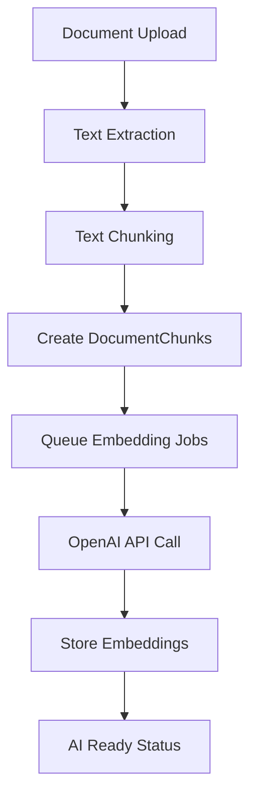

# OpenAI Embedding Integration Documentation

## Overview

The OnboardAI platform integrates with OpenAI's embedding API to transform document text into high-dimensional vectors that enable semantic search, content similarity matching, and AI-powered course generation.

## Key Features

### 🤖 **Automatic Embedding Generation**
- **Triggered Automatically**: Embeddings generated after document processing
- **Background Processing**: Uses Rails Active Job for scalable processing
- **Modern Model**: Uses `text-embedding-3-small` for efficiency and performance
- **Smart Chunking**: Processes text in optimal chunks for AI consumption

### 🔍 **Semantic Search Capabilities**
- **Vector Storage**: Embeddings stored using pgvector in PostgreSQL
- **Similarity Search**: Find related content across all documents
- **Context Retrieval**: AI assistants can access relevant document content
- **Course Generation**: Use document context for intelligent course creation

### 📊 **Processing Workflow**



## Configuration

### Environment Variables

Add these to your `.env` file:

```env
# Required for embedding generation
OPENAI_ACCESS_TOKEN=sk-your-openai-api-key-here

# Optional - if you have an organization
OPENAI_ORGANIZATION_ID=org-your-organization-id
```

### OpenAI API Setup

1. **Get API Key**:
   - Visit [OpenAI Platform](https://platform.openai.com/)
   - Create an account or sign in
   - Go to API Keys section
   - Create a new secret key

2. **Add to Environment**:
   ```bash
   echo "OPENAI_ACCESS_TOKEN=sk-your-key-here" >> .env
   ```

3. **Restart Application**:
   ```bash
   docker-compose restart web
   ```

## Technical Implementation

### Core Components

#### 1. OpenaiService

```ruby
class OpenaiService
  def self.generate_embedding(text)
    # Validates text and API key
    # Truncates long text to fit API limits
    # Calls OpenAI embedding API
    # Returns vector array or nil on error
  end
end
```

**Features**:
- **Input Validation**: Checks for blank text and missing API key
- **Text Truncation**: Handles text longer than API limits (8000 chars)
- **Error Handling**: Graceful failure with detailed logging
- **Modern Model**: Uses `text-embedding-3-small` (1536 dimensions)

#### 2. EmbeddingGenerationJob

```ruby
class EmbeddingGenerationJob < ApplicationJob
  def perform(document_chunk)
    # Generate embedding via OpenaiService
    # Save to database
    # Log progress and errors
  end
end
```

**Features**:
- **Duplicate Prevention**: Skips chunks that already have embeddings
- **Error Recovery**: Re-raises errors for job retry mechanisms
- **Progress Tracking**: Detailed logging for monitoring
- **Graceful Degradation**: Works even without API key (logs warning)

#### 3. Document Processing Pipeline

```ruby
# Automatic trigger after document creation
after_commit :process_document, on: :create

# Processing flow
DocumentProcessingService.process(document)
├── Extract text from file
├── Split into optimized chunks
├── Create DocumentChunk records
└── Queue EmbeddingGenerationJob for each chunk
```

### Database Schema

#### DocumentChunk Model

```ruby
# Migration
add_column :document_chunks, :embedding, :vector, limit: 1536
add_index :document_chunks, :embedding, using: :ivfflat,
          opclass: :vector_cosine_ops

# Model
class DocumentChunk < ApplicationRecord
  has_neighbors :embedding  # Enable similarity search
end
```

#### Similarity Search

```ruby
# Find similar content
similar_chunks = DocumentChunk.search_similar(query_embedding, distance: :cosine)

# Usage in AI context
context_chunks = DocumentChunk.search_similar(user_query_embedding, distance: :cosine)
                              .limit(5)
                              .map(&:content)
```

## Processing Status Indicators

### Visual Status System

The admin interface shows real-time processing status:

| Status | Badge | Meaning |
|--------|--------|---------|
| 🤖 **AI Ready** | Green | Text processed + embeddings complete |
| 🔄 **Embeddings 75%** | Blue | Embedding generation in progress |
| 📝 **Processing Embeddings** | Orange | Starting embedding generation |
| ⏳ **Processing Text** | Yellow | Initial text extraction |
| ❌ **Processing Failed** | Red | Error in processing pipeline |

### Status Methods

```ruby
document.processing_complete?  # Text chunks created?
document.embeddings_complete? # All chunks have embeddings?
document.embeddings_progress  # Percentage (0-100)
document.ai_ready?           # Ready for AI operations?
```

## API Usage Examples

### Manual Embedding Generation

```ruby
# For testing or manual processing
text = "Your document content here"
embedding = OpenaiService.generate_embedding(text)

# Save to chunk
chunk.update!(embedding: embedding) if embedding
```

### Similarity Search

```ruby
# Find similar content
query = "developer onboarding process"
query_embedding = OpenaiService.generate_embedding(query)

similar_chunks = DocumentChunk
  .neighbors(:embedding, query_embedding, distance: :cosine)
  .limit(5)

# Use for AI context
context = similar_chunks.map(&:content).join("\n\n")
response = OpenaiService.chat_response(user_message, similar_chunks)
```

### Course Generation with Context

```ruby
# Generate course using document context
relevant_chunks = document.document_chunks
                         .where.not(embedding: nil)
                         .limit(10)

task_list = OpenaiService.generate_task_list(
  "Create developer onboarding course",
  relevant_chunks
)

course_details = OpenaiService.generate_course_details(
  task_list,
  relevant_chunks
)
```

## Monitoring & Debugging

### Log Analysis

The system provides detailed logging for monitoring:

```bash
# Watch processing logs
docker-compose logs -f web | grep -E "(Embedding|Processing|OpenAI)"

# Key log messages
✅ Successfully generated embedding for chunk 123 (1536 dimensions)
🚀 Queued embedding generation for chunk 456
📊 Document processing summary - Created: 6, Failed: 0
⚠️  OPENAI_ACCESS_TOKEN not configured - skipping embedding generation
❌ OpenAI Embedding Error: Rate limit exceeded
```

### Health Checks

```ruby
# Check system health
def embedding_system_health
  {
    api_configured: ENV['OPENAI_ACCESS_TOKEN'].present?,
    total_chunks: DocumentChunk.count,
    chunks_with_embeddings: DocumentChunk.where.not(embedding: nil).count,
    embedding_coverage: DocumentChunk.where.not(embedding: nil).count.to_f / DocumentChunk.count * 100
  }
end
```

### Performance Monitoring

```ruby
# Check processing performance
recent_documents = Document.where(created_at: 1.hour.ago..)
processing_times = recent_documents.map do |doc|
  {
    id: doc.id,
    chunks: doc.document_chunks.count,
    embeddings_complete: doc.embeddings_complete?,
    processing_time: doc.ai_ready? ? time_to_ai_ready(doc) : 'In Progress'
  }
end
```

## Error Handling & Troubleshooting

### Common Issues

#### 1. **Missing API Key**
```
⚠️ OPENAI_ACCESS_TOKEN not configured - skipping embedding generation
```
**Solution**: Add your OpenAI API key to `.env`

#### 2. **Rate Limiting**
```
❌ OpenAI Embedding Error: Rate limit exceeded
```
**Solution**: Implement exponential backoff or upgrade OpenAI plan

#### 3. **Invalid API Key**
```
❌ OpenAI Embedding Error: Incorrect API key provided
```
**Solution**: Verify your API key is correct and active

#### 4. **Text Too Long**
```
❌ OpenAI Embedding Error: Text too long for model
```
**Solution**: Already handled - text is automatically truncated

#### 5. **Network Issues**
```
❌ OpenAI Embedding Error: Connection timeout
```
**Solution**: Job will retry automatically via Rails job queue

### Recovery Strategies

#### Retry Failed Embeddings
```ruby
# Find chunks without embeddings
chunks_needing_embeddings = DocumentChunk.where(embedding: nil)

# Requeue embedding generation
chunks_needing_embeddings.each do |chunk|
  EmbeddingGenerationJob.perform_later(chunk)
end
```

#### Bulk Reprocessing
```ruby
# Reprocess all documents without embeddings
Document.joins(:document_chunks)
        .where(document_chunks: { embedding: nil })
        .distinct
        .each do |doc|
          DocumentProcessingJob.perform_later(doc)
        end
```

## Cost Optimization

### Token Usage

- **Model**: `text-embedding-3-small` - $0.00002 per 1K tokens
- **Average Document**: ~1000 tokens → $0.00002
- **Chunk Processing**: 6 chunks × $0.00002 = $0.00012 per document

### Optimization Strategies

1. **Smart Chunking**: Optimal chunk sizes (1000 chars with 200 overlap)
2. **Deduplication**: Skip existing embeddings
3. **Batch Processing**: Process multiple chunks efficiently
4. **Error Handling**: Avoid unnecessary retries

## Integration with AI Features

### Course Generation Pipeline

```ruby
# 1. Find relevant content
context_chunks = DocumentChunk
  .joins(:document)
  .where(documents: { ai_ready: true })
  .limit(10)

# 2. Generate course structure
course_data = OpenaiService.generate_course_details(
  prompt: "Create onboarding course",
  context_chunks: context_chunks
)

# 3. Create course with AI context
course = Course.create!(
  title: course_data['title'],
  description: course_data['description'],
  steps_attributes: course_data['steps']
)
```

### Chat Assistant Context

```ruby
# Find relevant context for user query
user_query = "How do I set up my development environment?"
query_embedding = OpenaiService.generate_embedding(user_query)

relevant_context = DocumentChunk
  .neighbors(:embedding, query_embedding, distance: :cosine)
  .limit(3)

# Generate contextual response
response = OpenaiService.chat_response(
  user_query,
  relevant_context,
  conversation_history
)
```

## Future Enhancements

### Planned Features

1. **Multi-language Support**: Embeddings for different languages
2. **Advanced Indexing**: Optimized vector search with HNSW
3. **Batch Processing**: More efficient bulk embedding generation
4. **Caching Layer**: Redis cache for frequently accessed embeddings
5. **Analytics Dashboard**: Embedding usage and performance metrics

### Advanced Search Features

1. **Hybrid Search**: Combine text search with semantic similarity
2. **Filtering**: Search within specific document types or dates
3. **Ranking**: Weighted relevance scores
4. **Faceted Search**: Filter by document metadata

The OpenAI embedding integration transforms OnboardAI from a simple document manager into an intelligent, context-aware AI platform capable of understanding and leveraging your organization's knowledge base! 🚀🤖
